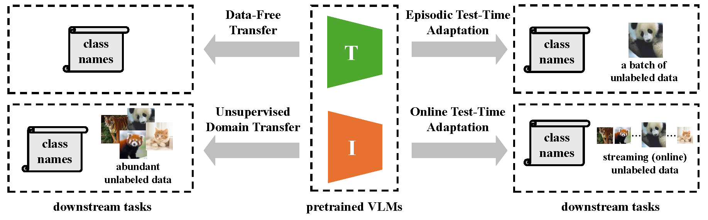

# Adapting Vision-Language Models Without Labels: A Comprehensive Survey <span><a href="https://arxiv.org/abs/2508.00000"></a></span> [](https://awesome.re)


This repository collects research papers on **unsupervised learning methods with VLMs**. The repository will be continuously updated to track the latest work in the community. 

**Keywords: Vision Language Model, xx, xxx**

## :fire: Update
- [Aug 6th, 2025] xxx

## :page_with_curl: Overview


## :sparkles: Contents
- [:spades: Data Free Transfer](cat/data_free_transfer.md)
- [:hearts: Unsupervised Domain Transfer](cat/unsupervised_domain_transfer.md)
- [:clubs: Episodic Test-Time Adaptation](cat/episodic_test_time_adaptation.md)
- [:diamonds: Online Test-Time Adaptation](cat/online_test_time_adaptation.md)

## 🤝 Citation
Please visit [Adapting Vision-Language Models Without Labels: A Comprehensive Survey](link) for more details and comprehensive information. If you find our paper and repo helpful, please consider citing it as follows:

```BibTeX
@article{dong2025adapting,
  title={Adapting Vision-Language Models Without Labels: A Comprehensive Survey}, 
  author={Dong, Hao and Sheng, Lijun and Liang, Jian and He, Ran and Chatzi, Eleni and Fink, Olga},
  journal={arXiv preprint arXiv:2508.xxxx}, 
  year={2025}}
```

## :collision: Selected Papers from Premier AI/ML Conferences

* `ICCV-2025` **[FLOSS: Free Lunch in Open-vocabulary Semantic Segmentation](https://arxiv.org/pdf/2504.10487)** [](https://github.com/yasserben/FLOSS)  
* `ICCV-2025` **[Generate, Transduct, Adapt: Iterative Transduction with VLMs](https://arxiv.org/pdf/2501.06031)**  
* `ICCV-2025` **[BATCLIP: Bimodal Online Test-Time Adaptation for CLIP](https://arxiv.org/pdf/2412.02837)** [](https://github.com/sarthaxxxxx/BATCLIP)  
* `ICCV-2025` **[Is Less More? Exploring Token Condensation as Training-free Test-time Adaptation](https://arxiv.org/pdf/2410.14729)**  
* `ICML-2025` **[From Local Details to Global Context: Advancing Vision-Language Models with Attention-based Selection](https://arxiv.org/pdf/2505.13233)** [](https://github.com/BIT-DA/ABS)  
* `ICML-2025` **[GS-Bias: Global-Spatial Bias Learner for Single-Image Test-Time Adaptation of Vision-Language Models](https://arxiv.org/pdf/2507.11969)** [](https://github.com/hzhxmu/GS-Bias)  
* `CVPR-2025` **[CLIP is Strong Enough to Fight Back: Test-time Counterattacks towards Zero-shot Adversarial Robustness of CLIP](https://arxiv.org/pdf/2503.03613)** [](https://github.com/Sxing2/CLIP-Test-time-Counterattacks)  
* `CVPR-2025` **[TAPT: Test-Time Adversarial Prompt Tuning for Robust Inference in Vision-Language Models](https://arxiv.org/pdf/2411.13136)** [](https://github.com/xinwong/TAPT)  
* `CVPR-2025` **[SCAP: Transductive Test-Time Adaptation via Supportive Clique-based Attribute Prompting](https://arxiv.org/pdf/2503.12866)** [](https://github.com/zhoujiahuan1991/CVPR2025-SCAP)  
* `CVPR-2025` **[O-TPT: Orthogonality Constraints for Calibrating Test-time Prompt Tuning in Vision-Language Models](https://arxiv.org/pdf/2503.12096)** [](https://github.com/ashshaksharifdeen/O-TPT)  
* `CVPR-2025` **[R-TPT: Improving Adversarial Robustness of Vision-Language Models through Test-Time Prompt Tuning](https://arxiv.org/pdf/2504.11195)** [](https://github.com/TomSheng21/R-TPT)  
* `CVPR-2025` **[Realistic Test-Time Adaptation of Vision-Language Models](https://arxiv.org/pdf/2501.03729)** [](https://github.com/MaxZanella/StatA)  
* `CVPR-2025` **[SPARC: Score Prompting and Adaptive Fusion for Zero-Shot Multi-Label Recognition in Vision-Language Models](https://arxiv.org/pdf/2502.16911)** [](https://github.com/kjmillerCURIS/SPARC)  
* `CVPR-2025` **[Free on the Fly: Enhancing Flexibility in Test-Time Adaptation with Online EM](https://arxiv.org/pdf/2507.06973)**  
* `CVPR-2025` **[Bayesian Test-Time Adaptation for Vision-Language Models](https://arxiv.org/pdf/2503.09248)**  
* `CVPR-2025` **[COSMIC: Clique-Oriented Semantic Multi-space Integration for Robust CLIP Test-Time Adaptation](https://arxiv.org/pdf/2503.23388)** [](https://github.com/hf618/COSMIC)  
* `CVPR-2025` **[Hierarchical Knowledge Prompt Tuning for Multi-task Test-Time Adaptation](https://openaccess.thecvf.com/content/CVPR2025/papers/Zhang_Hierarchical_Knowledge_Prompt_Tuning_for_Multi-task_Test-Time_Adaptation_CVPR_2025_paper.pdf)**  
* `CVPR-2025` **[On the Zero-shot Adversarial Robustness of Vision-Language Models: A Truly Zero-shot and Training-free Approach](https://openaccess.thecvf.com/content/CVPR2025/papers/Tong_On_the_Zero-shot_Adversarial_Robustness_of_Vision-Language_Models_A_Truly_CVPR_2025_paper.pdf)**  
* `ICLR-2025` **[RA-TTA: Retrieval-Augmented Test-Time Adaptation for Vision-Language Models](https://openreview.net/pdf?id=V3zobHnS61)** [](https://github.com/kaist-dmlab/RA-TTA)  
* `ICLR-2025` **[Noisy Test-Time Adaptation in Vision-Language Models](https://openreview.net/pdf?id=iylpeTI0Ql)** [](https://github.com/tmlr-group/ZS-NTTA)  
* `ICLR-2025` **[Efficient and Context-Aware Label Propagation for Zero-/Few-Shot Training-Free Adaptation of Vision-Language Model](https://openreview.net/pdf?id=D10yarGQNk)** [](https://github.com/Yushu-Li/ECALP)  
* `ICLR-2025` **[DynaPrompt: Dynamic Test-Time Prompt Tuning](https://openreview.net/pdf?id=EFZEdHB3Mp)** [](https://github.com/zzzx1224/DynaPrompt)  
* `ICLR-2025` **[Test-time Adaptation for Cross-modal Retrieval with Query Shift](https://openreview.net/pdf?id=BmG88rONaU)** [](https://github.com/XLearning-SCU/2025-ICLR-TCR)  
* `AAAI-2025` **[Learning to Prompt with Text Only Supervision for Vision-Language Models](https://arxiv.org/pdf/2401.02418)** [](https://github.com/muzairkhattak/ProText)  
* `AAAI-2025` **[Spurious Feature Eraser: Stabilizing Test-Time Adaptation for Vision-Language Foundation Model](https://arxiv.org/pdf/2403.00376)** [](https://github.com/MaHuanAAA/SEraser)  
* `WACV-2025` **[Pay Attention to Your Neighbours: Training-Free Open-Vocabulary Semantic Segmentation](https://arxiv.org/pdf/2404.08181)** [](https://github.com/sinahmr/NACLIP)  
* `WACV-2025` **[Enhancing Visual Classification using Comparative Descriptors](https://arxiv.org/pdf/2411.05357)** [](https://github.com/hk1ee/Comparative-CLIP)  
* `WACV-2025` **[DPA: Dual Prototypes Alignment for Unsupervised Adaptation of Vision-Language Models](https://arxiv.org/pdf/2408.08855)**  
* `WACV-2025` **[LATTECLIP: Unsupervised CLIP Fine-Tuning via LMM-Synthetic Texts](https://arxiv.org/pdf/2410.08211)** [](https://github.com/astra-vision/LatteCLIP)  
* `WACV-2025` **[Test-Time Low Rank Adaptation via Confidence Maximization for Zero-Shot Generalization of Vision-Language Models](https://arxiv.org/pdf/2407.15913)** [](https://github.com/Razaimam45/TTL-Test-Time-Low-Rank-Adaptation)  
* `WACV-2025` **[Just Shift It: Test-Time Prototype Shifting for Zero-Shot Generalization with Vision-Language Models](https://arxiv.org/pdf/2403.12952)** [](https://github.com/elaine-sui/TPS)  
* `WACV-2025` **[Pay Attention to Your Neighbours: Training-Free Open-Vocabulary Semantic Segmentation](https://arxiv.org/pdf/2404.08181)** [](https://github.com/sinahmr/NACLIP)  
* `WACV-2025` **[CLIPArTT: Adaptation of CLIP to New Domains at Test Time](https://arxiv.org/pdf/2405.00754)** [](https://github.com/dosowiechi/CLIPArTT)  
* `IJCV-2025` **[Diffusion-Enhanced Test-time Adaptation with Text and Image Augmentation](https://arxiv.org/pdf/2412.09706)** [](https://github.com/chunmeifeng/DiffTPT)  
* `TIP-2025` **[Task-to-Instance Prompt Learning for Vision-Language Models at Test Time](https://ieeexplore.ieee.org/document/10925517)** [](https://github.com/zhiheLu/TIPPLE)  
* `PR-2025` **[A Closer Look at the Explainability of Contrastive Language-Image Pre-training](https://arxiv.org/pdf/2304.05653)** [](https://github.com/xmed-lab/CLIP_Surgery)  
* `PR-2025` **[CTPT: Continual Test-time Prompt Tuning for Vision-Language Models](https://www.sciencedirect.com/science/article/pii/S0031320324010513)**  
* `NeurIPS-2024` **[Boosting Vision-Language Models with Transduction](https://arxiv.org/pdf/2406.01837)** [](https://github.com/MaxZanella/transduction-for-vlms)  
* `NeurIPS-2024` **[OTTER: Effortless Label Distribution Adaptation of Zero-shot Models](https://arxiv.org/pdf/2404.08461)** [](https://github.com/SprocketLab/OTTER)  
* `NeurIPS-2024` **[Frustratingly Easy Test-Time Adaptation of Vision-Language Models](https://arxiv.org/pdf/2405.18330)** [](https://github.com/FarinaMatteo/zero)  
* `NeurIPS-2024` **[AWT: Transferring Vision-Language Models via Augmentation, Weighting, and Transportation](https://arxiv.org/pdf/2407.04603)** [](https://github.com/MCG-NJU/AWT)  
* `NeurIPS-2024` **[WATT: Weight Average Test-Time Adaptation of CLIP](https://arxiv.org/pdf/2406.13875)** [](https://github.com/Mehrdad-Noori/WATT)  
* `NeurIPS-2024` **[Dual Prototype Evolving for Test-Time Generalization of Vision-Language Models](https://arxiv.org/pdf/2410.12790)** [](https://github.com/zhangce01/DPE-CLIP)  
* `NeurIPS-2024` **[BoostAdapter: Improving Vision-Language Test-Time Adaptation via Regional Bootstrapping](https://arxiv.org/pdf/2410.15430)** [](https://github.com/taolinzhang/BoostAdapter)  
* `NeurIPS-2024` **[Historical Test-time Prompt Tuning for Vision Foundation Models](https://arxiv.org/pdf/2410.20346)**  
* `ACMMM-2024` **[WaveDN: A Wavelet-based Training-free Zero-shot Enhancement for Vision-Language Models](https://openreview.net/pdf?id=di99IjsY2T)**  
* `ACMMM-2024` **[Towards Robustness Prompt Tuning with Fully Test-Time Adaptation for CLIP’s Zero-Shot Generalization](https://dl.acm.org/doi/pdf/10.1145/3664647.3681213)**  
* `ECCV-2024` **[Meta-Prompting for Automating Zero-shot Visual Recognition with LLMs](https://arxiv.org/pdf/2403.11755)** [](https://github.com/jmiemirza/Meta-Prompting)  
* `ECCV-2024` **[SCLIP: Rethinking Self-Attention for Dense Vision-Language Inference](https://arxiv.org/pdf/2312.01597)** [](https://github.com/wangf3014/SCLIP)  
* `ECCV-2024` **[ClearCLIP: Decomposing CLIP Representations for Dense Vision-Language Inference](https://arxiv.org/pdf/2407.12442)** [](https://github.com/mc-lan/ClearCLIP)  
* `ECCV-2024` **[ProxyCLIP: Proxy Attention Improves CLIP for Open-Vocabulary Segmentation](https://arxiv.org/pdf/2408.04883)** [](https://github.com/mc-lan/ProxyCLIP)  
* `ECCV-2024` **[TAG: Text Prompt Augmentation for Zero-Shot Out-of-Distribution Detection](https://openreview.net/pdf?id=ghJXIRlKat#page=7.41)** [](https://github.com/XixiLiu95/TAG)  
* `ECCV-2024` **[Improving Zero-shot Generalization of Learned Prompts via Unsupervised Knowledge Distillation](https://arxiv.org/pdf/2407.03056)** [](https://github.com/miccunifi/KDPL)  
* `ECCV-2024` **[uCAP: An Unsupervised Prompting Method for Vision-Language Models](https://www.ecva.net/papers/eccv_2024/papers_ECCV/papers/09508.pdf)**  
* `ECCV-2024` **[Robust Calibration of Large Vision-Language Adapters](https://arxiv.org/pdf/2407.13588)** [](https://github.com/Bala93/CLIPCalib)  
* `ECCV-2024` **[Robust Calibration of Large Vision-Language Adapters](https://arxiv.org/pdf/2407.13588)** [](https://github.com/Bala93/CLIPCalib)  
* `ECCV-2024` **[Explore the Potential of CLIP for Training-Free Open Vocabulary Semantic Segmentation](https://arxiv.org/pdf/2407.08268)** [](https://github.com/leaves162/CLIPtrase)  
* `ECCV-2024` **[In Defense of Lazy Visual Grounding for Open-Vocabulary Semantic Segmentation](https://arxiv.org/pdf/2408.04961)** [](https://github.com/dahyun-kang/lavg)  
* `ECCV-2024` **[Online Zero-Shot Classification with CLIP](https://arxiv.org/pdf/2408.13320)** [](https://github.com/idstcv/OnZeta)  
* `IJCAI-2024` **[DTS-TPT: Dual Temporal-Sync Test-time Prompt Tuning for Zero-shot Activity Recognition](https://www.ijcai.org/proceedings/2024/0170.pdf)** [](https://github.com/quhongyu/DTS-TPT)  
* `ICML-2024` **[Envisioning Outlier Exposure by Large Language Models for Out-of-Distribution Detection](https://arxiv.org/pdf/2406.00806)** [](https://github.com/tmlr-group/EOE)  
* `ICML-2024` **[Realistic Unsupervised CLIP Fine-tuning with Universal Entropy Optimization](https://openreview.net/pdf?id=XxCfToC9pJ)** [](https://github.com/tim-learn/UEO)  
* `ICML-2024` **[Candidate Pseudolabel Learning: Enhancing Vision-Language Models by Prompt Tuning with Unlabeled Data](https://arxiv.org/pdf/2406.10502)** [](https://github.com/vanillaer/CPL-ICML2024)  
* `ICML-2024` **[Robust CLIP: Unsupervised Adversarial Fine-Tuning of Vision Embeddings for Robust Large Vision-Language Models](https://arxiv.org/pdf/2402.12336)** [](https://github.com/chs20/RobustVLM)  
* `ICML-2024` **[Visual-Text Cross Alignment: Refining the Similarity Score in Vision-Language Models](https://arxiv.org/pdf/2406.02915)** [](https://github.com/tmlr-group/WCA)  
* `CVPR-2024` **[Grounding Everything: Emerging Localization Properties in Vision-Language Transformers](https://openaccess.thecvf.com/content/CVPR2024/papers/Bousselham_Grounding_Everything_Emerging_Localization_Properties_in_Vision-Language_Transformers_CVPR_2024_paper.pdf)** [](https://github.com/WalBouss/GEM)  
* `CVPR-2024` **[The Neglected Tails in Vision-Language Models](https://openaccess.thecvf.com/content/CVPR2024/papers/Parashar_The_Neglected_Tails_in_Vision-Language_Models_CVPR_2024_paper.pdf)** [](https://github.com/shubhamprshr27/NeglectedTailsVLM)  
* `CVPR-2024` **[PromptKD: Unsupervised Prompt Distillation for Vision-Language Models](https://openaccess.thecvf.com/content/CVPR2024/papers/Li_PromptKD_Unsupervised_Prompt_Distillation_for_Vision-Language_Models_CVPR_2024_paper.pdf)** [](https://github.com/zhengli97/PromptKD)  
* `CVPR-2024` **[Label Propagation for Zero-shot Classification with Vision-Language Models](https://openaccess.thecvf.com/content/CVPR2024/papers/Stojni_Label_Propagation_for_Zero-shot_Classification_with_Vision-Language_Models_CVPR_2024_paper.pdf)** [](https://github.com/vladan-stojnic/ZLaP)  
* `CVPR-2024` **[Transductive Zero-Shot and Few-Shot CLIP](https://arxiv.org/pdf/2405.18437)** [](https://github.com/SegoleneMartin/transductive-CLIP)  
* `CVPR-2024` **[On the Test-Time Zero-Shot Generalization of Vision-Language Models: Do We Really Need Prompt Learning?](https://arxiv.org/pdf/2405.02266)** [](https://github.com/MaxZanella/MTA)  
* `CVPR-2024` **[Test-Time Zero-Shot Temporal Action Localization](https://arxiv.org/pdf/2404.05426)** [](https://github.com/benedettaliberatori/T3AL)  
* `CVPR-2024` **[Leveraging Cross-Modal Neighbor Representation for Improved CLIP Classification](https://arxiv.org/pdf/2404.17753)** [](https://github.com/YCaigogogo/CODER)  
* `CVPR-2024` **[Grounding Everything: Emerging Localization Properties in Vision-Language Transformers](https://openaccess.thecvf.com/content/CVPR2024/papers/Bousselham_Grounding_Everything_Emerging_Localization_Properties_in_Vision-Language_Transformers_CVPR_2024_paper.pdf)** [](https://github.com/WalBouss/GEM)  
* `CVPR-2024` **[Efficient Test-Time Adaptation of Vision-Language Models](https://arxiv.org/pdf/2403.18293)** [](https://github.com/kdiAAA/TDA)  
* `CVPR-2024` **[Dual Memory Networks: A Versatile Adaptation Approach for Vision-Language Models](https://arxiv.org/pdf/2403.17589)** [](https://github.com/YBZh/DMN)  
* `CVPR-2024` **[Improved Self-Training for Test-Time Adaptation](https://openaccess.thecvf.com/content/CVPR2024/papers/Ma_Improved_Self-Training_for_Test-Time_Adaptation_CVPR_2024_paper.pdf)**  
* `CVPR-2024` **[Any-Shift Prompting for Generalization over Distributions](https://arxiv.org/pdf/2402.10099)**  
* `ICLR-2024` **[Test-Time Adaptation with CLIP Reward for Zero-Shot Generalization in Vision-Language Models](https://arxiv.org/pdf/2305.18010)** [](https://github.com/mzhaoshuai/RLCF)  
* `ICLR-2024` **[C-TPT: Calibrated Test-Time Prompt Tuning for Vision-Language Models via Text Feature Dispersion](https://arxiv.org/pdf/2403.14119)** [](https://github.com/hee-suk-yoon/C-TPT)  
* `ICLR-2024` **[PerceptionCLIP: Visual Classification by Inferring and Conditioning on Contexts](https://openreview.net/pdf?id=2Oiee202rd)** [](https://github.com/umd-huang-lab/perceptionCLIP)  
* `ICLR-2024` **[Follow-Up Differential Descriptions: Language Models Resolve Ambiguities for Image Classification](https://arxiv.org/pdf/2311.07593)** [](https://github.com/BatsResearch/fudd)  
* `AAAI-2024` **[Robust Test-Time Adaptation for Zero-Shot Prompt Tuning](https://ojs.aaai.org/index.php/AAAI/article/view/29611/31034)**  
* `AAAI-2024` **[DART: Dual-Modal Adaptive Online Prompting and Knowledge Retention for Test-Time Adaptation](https://ojs.aaai.org/index.php/AAAI/article/view/29320/30490)** [](https://github.com/zhoujiahuan1991/AAAI2024-DART)  
* `WACV-2024` **[ReCLIP: Refine Contrastive Language Image Pre-Training with Source Free Domain Adaptation](https://openaccess.thecvf.com/content/WACV2024/papers/Hu_ReCLIP_Refine_Contrastive_Language_Image_Pre-Training_With_Source_Free_Domain_WACV_2024_paper.pdf)** [](https://github.com/michiganleon/ReCLIP_WACV)  
* `WACV-2024` **[CLIP-DIY: CLIP Dense Inference Yields Open-Vocabulary Semantic Segmentation For-Free](https://arxiv.org/pdf/2309.14289)** [](https://github.com/wysoczanska/clip-diy)  
* `WACV-2024` **[DiffCLIP: Leveraging Stable Diffusion for Language Grounded 3D Classification](https://arxiv.org/pdf/2305.15957)** [](https://github.com/SitianShen/DiffCLIP)  
* `NeurIPS-2023` **[Neural Priming for Sample-Efficient Adaptation](https://proceedings.neurips.cc/paper_files/paper/2023/file/cea5bc68b890bffb10f18aaaab2becb1-Paper-Conference.pdf)** [](https://github.com/RAIVNLab/neural-priming)  
* `NeurIPS-2023` **[ChatGPT-Powered Hierarchical Comparisons for Image Classification](https://proceedings.neurips.cc/paper_files/paper/2023/file/dc81297c791bb989deade65c6bd8c1d8-Paper-Conference.pdf)** [](https://github.com/Zhiyuan-R/ChatGPT-Powered-Hierarchical-Comparisons-for-Image-Classification)  
* `NeurIPS-2023` **[Neural Priming for Sample-Efficient Adaptation](https://proceedings.neurips.cc/paper_files/paper/2023/file/cea5bc68b890bffb10f18aaaab2becb1-Paper-Conference.pdf)** [](https://github.com/RAIVNLab/neural-priming)  
* `NeurIPS-2023` **[LaFTer: Label-Free Tuning of Zero-shot Classifier using Language and Unlabeled Image Collections](https://proceedings.neurips.cc/paper_files/paper/2023/file/123a18dfd821c8b440f42a00a27648d6-Paper-Conference.pdf)** [](https://github.com/jmiemirza/LaFTer)  
* `NeurIPS-2023` **[Enhancing CLIP with CLIP: Exploring Pseudolabeling for Limited-Label Prompt Tuning](https://proceedings.neurips.cc/paper_files/paper/2023/file/bf85879363044ca21f7868a3d1b4021c-Paper-Conference.pdf)** [](https://github.com/BatsResearch/menghini-neurips23-code)  
* `NeurIPS-2023` **[Intra-Modal Proxy Learning for Zero-Shot Visual Categorization with CLIP](https://proceedings.neurips.cc/paper_files/paper/2023/file/50a057e9fe79ffa3f4120fb6fb88071a-Paper-Conference.pdf)**  
* `NeurIPS-2023` **[SwapPrompt: Test-Time Prompt Adaptation for Vision-Language Models](https://proceedings.neurips.cc/paper_files/paper/2023/file/cdd0640218a27e9e2c0e52e324e25db0-Paper-Conference.pdf)**  
* `NeurIPS-2023` **[Diffusion-TTA: Test-time Adaptation of Discriminative Models via Generative Feedback](https://arxiv.org/pdf/2311.16102)** [](https://github.com/mihirp1998/Diffusion-TTA)  
* `NeurIPS-2023` **[Align Your Prompts: Test-Time Prompting with Distribution Alignment for Zero-Shot Generalization](https://arxiv.org/pdf/2311.01459)** [](https://github.com/jameelhassan/PromptAlign)  
* `NeurIPS-2023` **[SwapPrompt: Test-Time Prompt Adaptation for Vision-Language Models](https://openreview.net/pdf?id=EhdNQiOWgQ)**  
* `NeurIPS-2023` **[Test-Time Distribution Normalization for Contrastively Learned Vision-language Models](https://arxiv.org/pdf/2302.11084)** [](https://github.com/fengyuli-dev/distribution-normalization)  
* `ACMMM-2023` **[VPA: Fully Test-Time Visual Prompt Adaptation](https://arxiv.org/pdf/2309.15251)**  
* `ICCV-2023` **[What Does a Platypus Look Like? Generating Customized Prompts for Zero-Shot Image Classification](https://openaccess.thecvf.com/content/ICCV2023/papers/Pratt_What_Does_a_Platypus_Look_Like_Generating_Customized_Prompts_for_ICCV_2023_paper.pdf)** [](https://github.com/sarahpratt/CuPL)  
* `ICCV-2023` **[SuS-X: Training-Free Name-Only Transfer of Vision-Language Models](https://openaccess.thecvf.com/content/ICCV2023/papers/Udandarao_SuS-X_Training-Free_Name-Only_Transfer_of_Vision-Language_Models_ICCV_2023_paper.pdf)** [](https://github.com/vishaal27/SuS-X)  
* `ICCV-2023` **[Waffling around for Performance: Visual Classification with Random Words and Broad Concepts](https://openaccess.thecvf.com/content/ICCV2023/papers/Roth_Waffling_Around_for_Performance_Visual_Classification_with_Random_Words_and_ICCV_2023_paper.pdf)** [](https://github.com/ExplainableML/WaffleCLIP)  
* `ICCV-2023` **[Diverse Data Augmentation with Diffusions for Effective Test-time Prompt Tuning](https://arxiv.org/pdf/2308.06038)** [](https://github.com/chunmeifeng/DiffTPT)  
* `ICML-2023` **[CHiLS: Zero-Shot Image Classification with Hierarchical Label Sets](https://proceedings.mlr.press/v202/novack23a/novack23a.pdf)** [](https://github.com/acmi-lab/CHILS)  
* `ICML-2023` **[A Simple Zero-shot Prompt Weighting Technique to Improve Prompt Ensembling in Text-Image Models](https://arxiv.org/pdf/2302.06235)**  
* `ICML-2023` **[POUF: Prompt-Oriented Unsupervised Fine-tuning for Large Pre-trained Models](https://proceedings.mlr.press/v202/tanwisuth23a/tanwisuth23a.pdf)** [](https://github.com/korawat-tanwisuth/POUF)  
* `CVPR-2023` **[Texts as Images in Prompt Tuning for Multi-Label Image Recognition](https://openaccess.thecvf.com/content/CVPR2023/papers/Guo_Texts_as_Images_in_Prompt_Tuning_for_Multi-Label_Image_Recognition_CVPR_2023_paper.pdf)** [](https://github.com/guozix/TaI-DPT)  
* `CVPR-2023` **[Improving Zero-shot Generalization and Robustness of Multi-modal Models](https://arxiv.org/pdf/2212.01758)** [](https://github.com/gyhandy/Hierarchy-CLIP)  
* `CVPR-2023` **[Texts as Images in Prompt Tuning for Multi-Label Image Recognition](https://openaccess.thecvf.com/content/CVPR2023/papers/Guo_Texts_as_Images_in_Prompt_Tuning_for_Multi-Label_Image_Recognition_CVPR_2023_paper.pdf)** [](https://github.com/guozix/TaI-DPT)  
* `ICLR-2023` **[Visual Classification via Description from Large Language Models](https://openreview.net/pdf?id=jlAjNL8z5cs)** [](https://github.com/sachit-menon/classify_by_description_release)  
* `ICLR-2023` **[Masked Unsupervised Self-training for Label-free Image Classification](https://openreview.net/pdf/4727dfde7523443e21ec3f97b19eeba777450c3e.pdf)** [](https://github.com/salesforce/MUST)  
* `AAAI-2023` **[CALIP: Zero-Shot Enhancement of CLIP with Parameter-free Attention](https://arxiv.org/pdf/2209.14169)** [](https://github.com/ZiyuGuo99/CALIP)  
* `NeurIPS-2022` **[ReCo: Retrieve and Co-segment for Zero-shot Transfer](https://arxiv.org/pdf/2206.07045)** [](https://github.com/NoelShin/reco)  
* `NeurIPS-2022` **[Test-Time Prompt Tuning for Zero-Shot Generalization in Vision-Language Models](https://arxiv.org/pdf/2209.07511)** [](https://github.com/azshue/TPT)  
* `NeurIPS-2022` **[ReCo: Retrieve and Co-segment for Zero-shot Transfer](https://arxiv.org/pdf/2206.07045)** [](https://github.com/NoelShin/reco)  
* `ECCV-2022` **[Extract Free Dense Labels from CLIP](https://arxiv.org/pdf/2112.01071)** [](https://github.com/chongzhou96/MaskCLIP)  
* `ICML-2021` **[Learning Transferable Visual Models From Natural Language Supervision](https://proceedings.mlr.press/v139/radford21a/radford21a.pdf)** [](https://github.com/openai/CLIP) 
